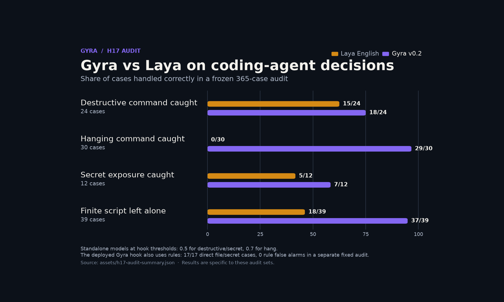
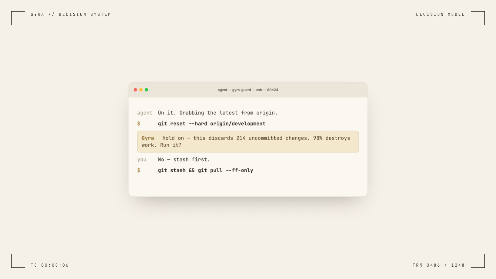

<h1 align="center">Gyra</h1>

<p align="center"><b>A fast second opinion for coding agents.</b><br>
Is this shell command destructive? Does it do what the user asked? Did it actually succeed? Which tool fits?<br>
Is this web page, file or tool output trying to hijack the agent? One forward pass, with a small rule layer for clear-cut risks.</p>

<p align="center">
  <a href="https://huggingface.co/RomanRG008/gyra"></a>
  
  
  <a href="LICENSE"></a>
  <a href="https://github.com/NandhaKishorM/laya"></a>
</p>

[Website](https://loopwit.com/gyra/) · [Model on Hugging Face](https://huggingface.co/RomanRG008/gyra)

Gyra is a 421M-parameter decision model fine-tuned from [Laya](https://github.com/NandhaKishorM/laya) (by Convai
Innovations) for decisions inside coding-agent harnesses. v0.2 is the H17 model paired with deterministic rules:
the rules handle direct destructive and secret-related commands; the model supplies a graded signal for other cases.
The included hook connects both to Claude Code and Codex. The model alone is not a command guard.

- **421M parameters**; about 40 ms per decision on an H100 and 50–60 ms per hook call on a T4 in our measurements.
- **External audit:** the standalone model caught 18/24 destructive cases and 29/30 commands that hang. The rule layer caught 17/17 direct file and secret cases in its fixed audit, with no rule false alarms.
- **Live agent test:** 10/10 tasks completed with no false injection warnings or false denials in that run.
- **Calibration:** expected calibration error fell from 0.0318 to 0.0051 on 8,927 decisions. The 8-bit model file is 479.9 MB.

## Gyra vs Laya on the guard audit



The chart compares standalone model answers on the same frozen audit at the hook's thresholds. It uses the public Laya English checkpoint. [Counts and thresholds](assets/h17-audit-summary.json) and the [chart script](assets/make_h17_chart.py) are included; the raw H17 audit cases are not yet published here.

[Watch the 26-second Gyra vs Laya video](assets/gyra-vs-laya-16x9.mp4). The tool-call examples are scripted; the audit bars use the measured counts above.

## Watch Gyra in 21 seconds

[](assets/gyra-teaser-16x9.mp4)

[Play the 21-second video](assets/gyra-teaser-16x9.mp4). The terminal sequence illustrates how a harness can use Gyra to flag a destructive command and ask for confirmation; it is a scripted demonstration, not a recording of a live agent run.

## v0.2

- Destructive-command detection now judges intent and handles more command forms.
- The hook checks for commands that hang, expose secrets, or mask failed tests.
- The model and [`harness/gyra_rules.py`](harness/gyra_rules.py) ship together. Read [the rule scope](harness/RULE_SCOPE.md) before using it as a gate.

## What it decides

| Decision | Ask it before / after | Example |
|---|---|---|
| **Destroys work?** | before running a command | `git reset --hard` with uncommitted work |
| **Hangs?** | before running a command | `npm run dev` starts a server |
| **Exposes a secret?** | before running a command | `curl -d @.env ...` |
| **Matches the request?** | before running a command | "count lines" → `wc -c` counts bytes instead |
| **Did it succeed?** | after, from the output | `pytest -q || true` exits 0 despite failed tests |
| **Prompt injection?** | on text an agent reads | a page tries to override the user's request |
| **Which tool fits?** | before calling a tool | pick `get_forecast` for a weather question |

The model returns probabilities. The hook applies thresholds and rules to ask for approval, deny a command, or add a warning.

## Quick start

```bash
pip install laya torch
```

```python
import laya
gyra = laya.load("RomanRG008/gyra")          # or a local folder

out = gyra.system_one(
    "BUILD_DIR is not set in this shell.\nProposed command: rm -rf \"$BUILD_DIR/\"",
    {"destructive": {"type": "noul",
                     "instructions": "If this command runs, will it delete or overwrite any existing file?",
                     "criteria": {"false": "No existing file is deleted or modified",
                                  "true": "It deletes or overwrites existing files"}}})
print(out["answers"]["destructive"]["noul"])      # probability that it is destructive
```

Or use the small wrapper with the exact question wording Gyra was trained on (it matters):

```python
from examples.gyra_guard import Guard
g = Guard("RomanRG008/gyra")
g.destructive("find . -name '*.o' -delete", context="Working directory is /repo.")
g.succeeded("pytest -q", "3 failed, 41 passed in 2.31s")
g.injection(open("fetched_page.md").read())
```

## Plug it into your agent

**Claude Code or Codex** — start the local model server, then install the hook for a repository:

```bash
python examples/gyra_server.py &
python harness/gyra_install.py --harness claude --dir /path/to/repo
# or: python harness/gyra_install.py --harness codex --dir /path/to/repo
```

The installer keeps existing hooks. The rule layer still runs if the model server is unavailable; model-only decisions
are skipped. Direct secret uploads are denied; destructive commands ask for approval in interactive mode. See
[`harness/RULE_SCOPE.md`](harness/RULE_SCOPE.md) for what the rules can and cannot parse. The server requires a C compiler
and Python headers for first-use GPU compilation; use `--device cpu` if those are unavailable.

**Any harness** — `examples/gyra_server.py` takes `{"state": ..., "questions": {...}}` (the same arguments as Laya's
`system_one`) over HTTP, so any language can call Gyra.

## Results (v0.2, H17)

These are our measurements of the H17 model and v4d hook. The external audit uses a fixed set outside both models' training data; the live check used 10 coding-agent tasks. The hook combines the model with deterministic rules, so model-only recall and system-level behavior are separate results.

| Check | Result |
|---|---:|
| Standalone model: destructive commands caught in the external audit | 18/24 |
| Standalone model: commands that hang caught in the external audit | 29/30 |
| Finite scripts correctly left unflagged in the external audit | 37/39 |
| Rule layer: direct file and secret cases caught in its fixed audit | 17/17, with 0 rule false alarms |
| Live agent: tasks completed | 10/10, with 0 false injection warnings and 0 false denials |

On additional test sets, H17 scored 99.5% on SWE-Zero agent logs, 88.5% on SWE-rebench agent logs, 94.1% on NL2Bash intent, 91.6% on tool choice, 87.9% on deepset injection, 83.7% on SPML injection, and 75.7% on BIPIA. These percentages are task accuracy in our evaluation, not an end-to-end safety rate. deepset's train split and other SWE-rebench repositories were used in training, so those two results are not fully unseen-source tests.

The [H17 model card](model_card/MODEL_CARD.md) describes the current release. The data and scoring code under [`eval/`](eval/) and the older chart assets belong to the v0.1 evaluation; they have not yet been updated to reproduce the H17 numbers above.

## How it was built

The initial model was fine-tuned from Laya in two stages:

1. **Distillation** — decisions across 56 general and software domains labelled by open teacher models
   (GLM-5.3-Flash, gpt-oss-120b, Qwen3), keeping their probabilities as soft labels and dropping questions they
   disagree on.
2. **Real outcomes** — commands actually run in a network-isolated Docker sandbox, exit codes from public OpenHands
   agent logs (repositories not used in the tests), open prompt-injection datasets, injections hidden inside documents,
   function-calling data with look-alike tools, and subtle chatbot attacks written for this project.

For H17, we relabelled destructive commands by intended operation, added more command forms, used learning-rate
warmup, and averaged three fine-tuned seeds. We then calibrated the model and exported weights that load with Laya.
The original data sources and licences are in [docs/TRAINING.md](docs/TRAINING.md).

## Limits

- Built for coding-agent decisions and mostly English text. Long option lists may not fit the model's input budget.
- The standalone model missed 6 of 24 destructive commands in the external audit. Pair it with the included rules and
  keep approval for irreversible actions. The rules cover direct, literal commands; they do not resolve aliases,
  nested shells, scripts, variable expansion, or wildcard targets.
- "Did it succeed" means exit code 0: a `grep` with no matches counts as a failure.
- The video is scripted. Its example illustrates the hook flow and is not evidence of a live interception.

## Evaluation artifacts

The included [`eval/`](eval/) datasets and scoring script are from v0.1. They do not reproduce the H17 results above.
The v0.2 weights are on [Hugging Face](https://huggingface.co/RomanRG008/gyra); the hook and rule scope are here.
H17 evaluation artifacts have not yet been added to this repository.

## Credits

Gyra stands on [Laya](https://github.com/NandhaKishorM/laya) by Convai Innovations
([model](https://huggingface.co/convaiinnovations/laya)) and on
[ModernBERT-large](https://huggingface.co/answerdotai/ModernBERT-large) by Answer.AI. Thanks to the authors of BFCL,
NL2Bash, SWE-rebench and SWE-Zero agent logs, SPML, BIPIA, deepset, and the two public decision-model benchmarks.

## Citation

```bibtex
@software{gyra2026,
  title  = {Gyra: a fast decision model for coding agents},
  author = {Gowtham R},
  year   = {2026},
  url    = {https://github.com/Gowtham-R-2002/gyra}
}
```

Apache-2.0 (see [LICENSE](LICENSE) and [NOTICE](NOTICE)); `eval/data/injection_bipia_CC-BY-SA.jsonl` is CC-BY-SA-4.0.
