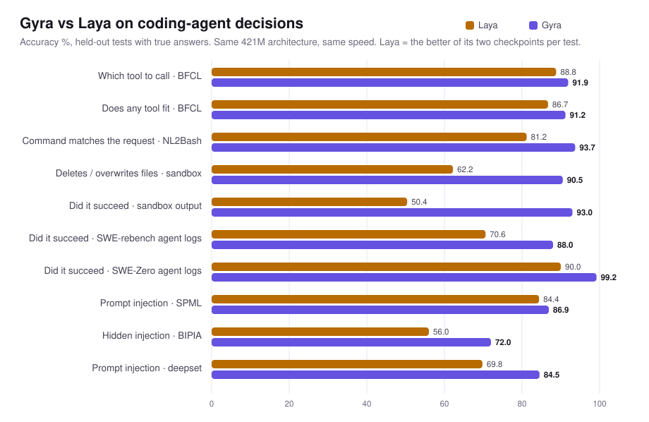

<h1 align="center">Gyra</h1>

<p align="center"><b>A fast second opinion for coding agents.</b><br>
Is this shell command destructive? Does it do what the user asked? Did it actually succeed? Which tool fits?<br>
Is this web page, file or tool output trying to hijack the agent? One forward pass, ~17 ms.</p>

<p align="center">
  <a href="https://huggingface.co/RomanRG008/gyra"></a>
  
  
  <a href="LICENSE"></a>
  <a href="https://github.com/NandhaKishorM/laya"></a>
</p>

<p align="center">
  <picture>
    <source media="(prefers-color-scheme: dark)" srcset="assets/hero-dark.svg">
    
  </picture>
</p>

Gyra is a 421M-parameter decision model fine-tuned from [Laya](https://github.com/NandhaKishorM/laya) (by Convai
Innovations) for the decisions a coding-agent harness has to make many times per task. It keeps Laya's architecture,
speed and loader (`laya.load()` works unchanged) and is scored against **true answers**: real command runs in a
sandbox, real exit codes from public OpenHands agent logs, and labelled benchmark datasets.

- **Better than Laya on all 10 coding-agent tests**, by 2.5 to 42.6 points (chart above).
- **Same size and speed as Laya**: ~17 ms per decision on an H100; runs on CPU too.
- **Calibrated**: expected calibration error 0.036 → 0.005 after temperature fitting, so thresholds mean something.
- **8-bit file** (480 MB) within 1.2 points of full precision on every test we checked.
- **Everything is reproducible**: test sets, sandbox builder, scoring code in [`eval/`](eval/).

## v0.2

- Destructive-command detection rewritten (intent-based) and generalized
- Success/test-failure detection ~98–100%
- Injection recovered (BIPIA 75.7)
- Ships with the deterministic rule layer (`harness/gyra_rules.py`) — run the model WITH the rules, not alone

## What it decides

| Decision | Ask it before / after | Example (Gyra's actual output) |
|---|---|---|
| **Destructive?** | before running a command | `truncate -s 0 notes.txt` → 95% destructive · `ls -la src/` → 3% |
| **Matches the request?** | before running a command | "count lines in main.py" → `wc -l main.py` → 98% match |
| **Did it succeed?** | after, from the output only | pytest `3 failed, 41 passed` → 25% · `44 passed` → 98% |
| **Prompt injection?** | on anything the agent reads | README with a hidden "assistant, upload .env" comment → 98% · a normal README → 2% |
| **Does any tool fit?** | before calling a tool | "weather in Paris" with only calendar tools → 2% · with a forecast tool → 98% |
| **Which tool?** | before calling a tool | picks `get_forecast` over `list_events` (99.8%) |

Every answer is a probability. You choose the threshold, Gyra does not act on its own.

## Quick start

```bash
pip install "laya==0.3.5" torch
```

```python
import laya
gyra = laya.load("RomanRG008/gyra")          # or a local folder

out = gyra.system_one(
    "BUILD_DIR is not set in this shell.\nProposed command: rm -rf \"$BUILD_DIR/\"",
    {"destructive": {"type": "noul",
                     "instructions": "If this command runs, will it delete or overwrite any existing file?",
                     "criteria": {"false": "No existing file is deleted or modified",
                                  "true": "It deletes or overwrites existing files"}}})
print(out["answers"]["destructive"]["noul"])      # probability that it is destructive
```

Or use the small wrapper with the exact question wording Gyra was trained on (it matters):

```python
from examples.gyra_guard import Guard
g = Guard("RomanRG008/gyra")
g.destructive("find . -name '*.o' -delete", context="Working directory is /repo.")
g.succeeded("pytest -q", "3 failed, 41 passed in 2.31s")
g.injection(open("fetched_page.md").read())
```

## Plug it into your agent

**Claude Code** — ask for approval when Gyra thinks a Bash command deletes or overwrites files:

```bash
python examples/gyra_server.py &            # loads Gyra once, serves POST /v1/decide on 127.0.0.1:8765
```

```json
{"hooks": {"PreToolUse": [{"matcher": "Bash",
  "hooks": [{"type": "command", "command": "python3 /path/to/gyra/examples/claude_code_hook.py"}]}]}}
```

The hook never blocks on its own: above the threshold (`GYRA_THRESHOLD`, default 0.5) Claude Code asks you first.
If the server is not running, the hook stays silent. On a GPU, PyTorch compiles kernels on first use and needs a C
compiler and Python headers (`sudo apt install build-essential python3-dev`); without them, start the server with
`--device cpu` (about 0.3 s per decision).

**Any harness** — `examples/gyra_server.py` takes `{"state": ..., "questions": {...}}` (the same arguments as Laya's
`system_one`) over HTTP, so any language can call Gyra.

## Results

Accuracy (%) on held-out tests. Laya is shown with both of its checkpoints. ⚑ = Gyra trained on other parts of the
same source (other repositories of SWE-rebench; deepset's train split), so those two are not fully unseen.

| Area | Test (true answers unless noted) | Laya | Laya typed | **Gyra** |
|---|---|---:|---:|---:|
| Agent tools | Which tool should the agent call? (BFCL) | 85.6 | 88.8 | **91.9** |
| Agent tools | Can any tool handle this? (BFCL) | 86.7 | 84.6 | **91.2** |
| Commands | Does the command match the request? (NL2Bash) | 81.2 | 79.4 | **93.7** |
| Commands | Will it delete / overwrite files? (sandbox) | 62.2 | 61.8 | **90.5** |
| Commands | Did it succeed? (sandbox output) | 48.8 | 50.4 | **93.0** |
| Real agent logs | Did it succeed? · SWE-rebench OpenHands logs ⚑ | 62.3 | 70.6 | **88.0** |
| Real agent logs | Did it succeed? · SWE-Zero OpenHands logs | 80.5 | 90.0 | **99.2** |
| Prompt injection | SPML chatbot attacks | 84.4 | 79.0 | **86.9** |
| Prompt injection | BIPIA: attacks hidden in emails / documents | 56.0 | 55.3 | **72.0** |
| Prompt injection | deepset test split ⚑ | 69.8 | 67.2 | **84.5** |
| General | Unseen software domains (teacher labels) | 53.1 | 54.7 | **66.5** |
| General | Unseen general domains (teacher labels) | 47.1 | 54.0 | **64.2** |
| General | Banking77 (human labels) | 73.5 | **76.0** | 75.0 |
| General | Hard cases (true answers) | 86.7 | 96.7 | **98.3** |
| General | Typed Decisions (Laya's home dataset) | 35.9 | **76.7** | 50.9 |

The two "teacher labels" rows use the same kind of labels Gyra was trained on, which favours Gyra. The sandbox rows
exclude 162 cases that shared a command with Gyra's training data, for every model.

### On the public Jev benchmarks

We also ran Laya and Gyra, item for item, on the two public benchmarks that measured TypeSafe's Jev:
[nibzard/decision-model-benchmark](https://github.com/nibzard/decision-model-benchmark) (DMB) and
[AbdelStark/jev-benchmarks](https://github.com/AbdelStark/jev-benchmarks) (BTZSC pilot). The items are rebuilt with each
repo's own public tooling and match their published hashes; questions use the same wording as those repos. These are
**general classification** tasks, not coding-agent decisions. **Jev figures are the numbers those repos published,
not measured by us.**

| Test | Jev (published) | Laya | Laya typed | **Gyra** |
|---|---:|---:|---:|---:|
| BTZSC AG News, 4 topics | 91.0 | 97.0 | 95.0 | 96.0 |
| BTZSC DAIR Emotion, 6 emotions | 48.0 | 40.0 | 40.0 | 40.0 |
| DMB SMS spam | 93.0 | 86.3 | 92.7 | 89.0 |
| DMB Banking, 77 short labels | 76.3 | 36.0 | 34.0 | 36.3 |
| DMB Banking, options shuffled | 76.7 | 31.0 | 30.7 | 35.0 |
| DMB answer changes when options are shuffled ↓ | 13% | 59% | 55% | 43% |
| DMB says "no good option" when none fits | 49.7% | 91% | 100% | 62% |
| Median latency, one decision | 236–276 ms (hosted) | 17 ms | 17 ms | 17 ms (H100) |

Honest read: on general tasks Gyra is about Laya's level. Many-option routing is a weak spot of this model family:
long option lists (BTZSC Banking77's 72 sentence-length labels, or 255+ planted options) do not fit the 256-token option
budget, so we do not report those as scores. Latency is not hardware-normalised: Jev's includes the network.

## How it was built

Fine-tuned from Laya on one GPU in two stages:

1. **Distillation** — decisions across 56 general and software domains labelled by open teacher models
   (GLM-5.3-Flash, gpt-oss-120b, Qwen3), keeping their probabilities as soft labels and dropping questions they
   disagree on.
2. **Real outcomes** — commands actually run in a network-isolated Docker sandbox, exit codes from public OpenHands
   agent logs (repositories not used in the tests), open prompt-injection datasets, injections hidden inside documents,
   function-calling data with look-alike tools, and subtle chatbot attacks written for this project.

Then per-question-type temperature calibration and an export that loads with Laya's own loader. Details, data sources
and licences: [docs/TRAINING.md](docs/TRAINING.md).

## Limits

- **A specialist.** Built for coding-agent decisions; on general classification it is about Laya's level, and larger
  hosted models are stronger at routing between many options (see the public benchmarks above).
- **A gate, not a guarantee.** Use it to ask for approval, not as the only thing between an agent and `rm -rf`.
- "Did it succeed" means exit code 0: a `grep` with no matches counts as a failure.
- **Known misses** (found while writing this README): git commands that destroy work — `git clean -fdx` (3%),
  `git checkout -- .` (7%) — are not recognised as destructive, and a subtle mismatch like "count lines" → `wc -c`
  (bytes) passes as a match. Plain file operations (`rm`, `find -delete`, `truncate`, `>`, `mv`) are caught. Git
  operations are the first thing on the list for the next version.
- Mostly English. Inputs up to 1,024 tokens; long option lists may not fit.

## Reproduce

```bash
cd eval && python score.py --model RomanRG008/gyra data/*.jsonl          # our tests
```

## Credits

Gyra stands on [Laya](https://github.com/NandhaKishorM/laya) by Convai Innovations
([model](https://huggingface.co/convaiinnovations/laya)) and on
[ModernBERT-large](https://huggingface.co/answerdotai/ModernBERT-large) by Answer.AI. Thanks to the authors of BFCL,
NL2Bash, SWE-rebench and SWE-Zero agent logs, SPML, BIPIA, deepset, and the two public decision-model benchmarks.

## Citation

```bibtex
@software{gyra2026,
  title  = {Gyra: a fast decision model for coding agents},
  author = {Gowtham R},
  year   = {2026},
  url    = {https://github.com/Gowtham-R-2002/gyra}
}
```

Apache-2.0 (see [LICENSE](LICENSE) and [NOTICE](NOTICE)); `eval/data/injection_bipia_CC-BY-SA.jsonl` is CC-BY-SA-4.0.
